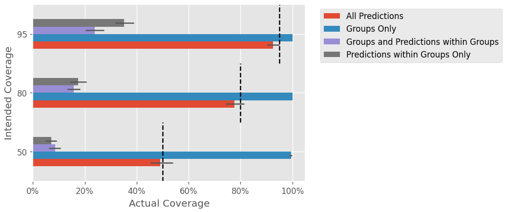

# Bootstrap-Simulations

Contains simulations run to answer this CV stack exchange question: <https://stats.stackexchange.com/questions/620746/mae-confidence-intervals-how-many-bootstraps>

Primary results:

